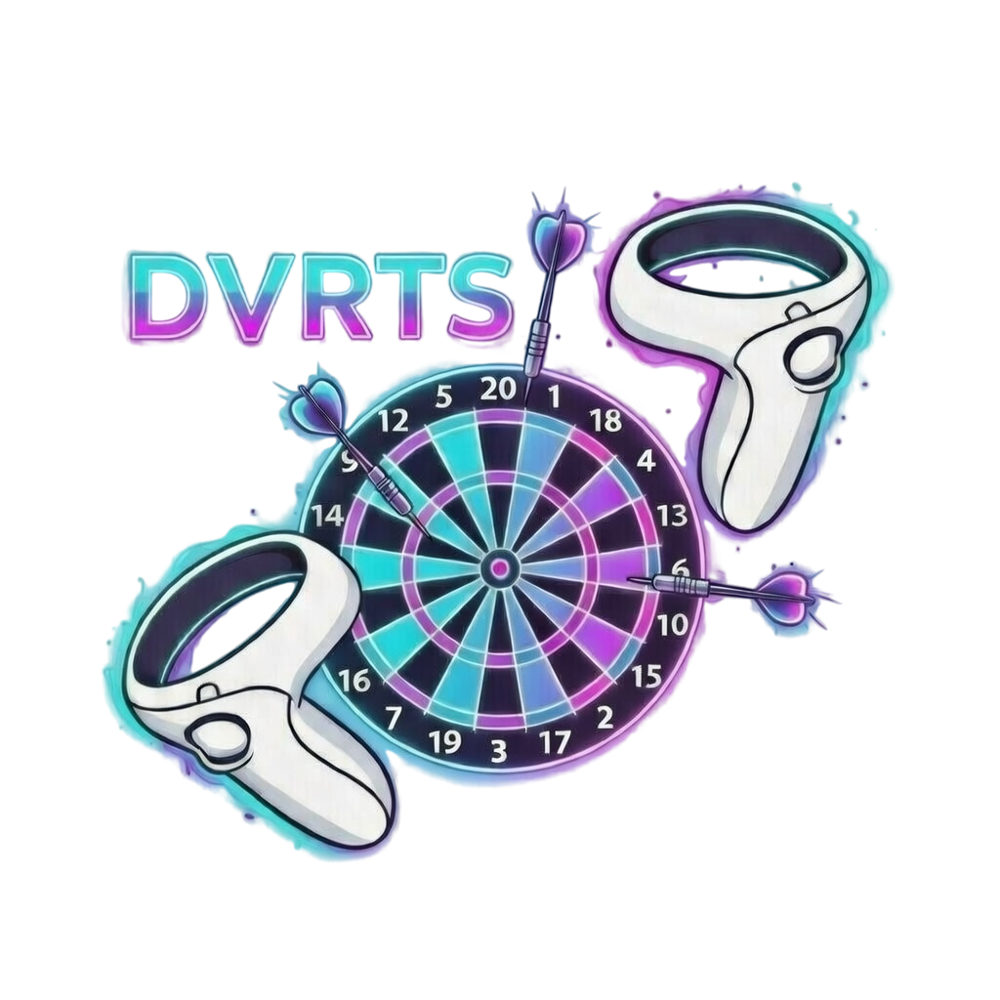

# DVRTS - A VR Darts Game

  

A virtual reality darts game developed as part of the DH2310 Extended Reality in Theory and Practice course at KTH. Players can pick up and throw darts at a board in an immersive VR environment, with realistic physics-based interactions. This project demonstrates XR interaction design, 3D modeling, and VR gameplay mechanics.
